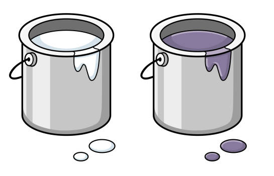

# Paint Pots

A [marimo](https://marimo.io/) demo notebook.


You have two 1-liter pots:
+ the left contains white paint  
+ the right contains colored paint  

Using a scoop of size s (<1 liter), you perform a step:

+ transfer s liters from right to left and mix
+ transfer s liters back from left to right and mix

This process is repeated multiple times.  

After each step, both pots have 1 liter of mixed paint.  
What is the fraction of colored paint in each pot after

+ one step ?
+ many steps ?

## Commands

+ Install

```sh
pip install "marimo[recommended]"
```

+ Run

```sh
marimo edit paint-pots.py
```

+ Export

```sh
# static
marimo export html paint-pots.py -o paint-pots.html

# dynamic
marimo export html-wasm paint-pots.py -o dist --mode run
```

+ Use

```sh
run-wasm.bat

# open browser
# http://localhost:8082
```

+ Deploy

```sh
# to github
deploy-ghp.bat

# open browser to
# https://oscar6echo.github.io/paint-pots/
```
